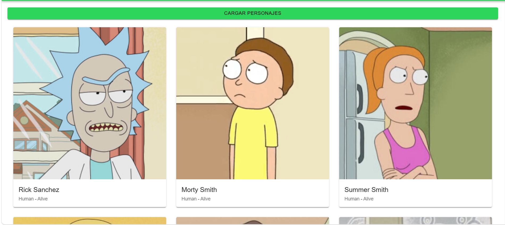
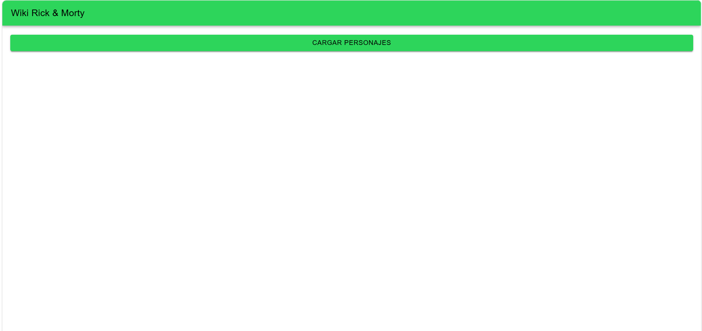

# Taller 4: Ionic + React + APIs 

Este proyecto es parte de los talleres prácticos de Ingeniería Web y Móvil. El objetivo principal fue aprender a construir interfaces de usuario dinámicas utilizando componentes de **Ionic** y **React**, consumiendo datos desde APIs externas.

##  Tecnologías utilizadas
* **Frontend:** Ionic Framework, React, TypeScript
* **Consumo de datos:** Fetch API
* **APIs integradas:** JSONPlaceholder (Posts) y The Rick and Morty API (Personajes)

## Proceso de Desarrollo
A lo largo de este taller, se implementó la transición desde la manipulación directa del DOM (usada en JavaScript tradicional) hacia el enfoque declarativo de React:
1. **Manejo de Estados:** Se utilizó el hook `useState` para controlar el ciclo de vida de las peticiones HTTP (estados de `cargando`, `error` y el almacenamiento de los `datos`).
2. **Componentes UI:** Se reemplazaron las etiquetas HTML estándar por componentes nativos de Ionic (`<IonCard>`, `<IonSpinner>`, `<IonGrid>`) para lograr un diseño responsivo y adaptado a dispositivos móviles.
3. **Renderizado Dinámico:** Se utilizó la función `.map()` para recorrer los arreglos de datos obtenidos de las APIs y generar las tarjetas de contenido dinámicamente.
4. **Desafío Adicional:** Se creó un componente extra (Wiki Rick & Morty) que extrae imágenes y datos anidados (`datos.results`) para mostrarlos en un formato de cuadrícula.

##  Capturas de Pantalla

### Sección de Publicaciones (JSONPlaceholder)



### Wiki Rick and Morty



##  Cómo ejecutar el proyecto
Para correr este proyecto localmente, ingresa a la carpeta del taller y ejecuta:
```bash
npm install
ionic serve